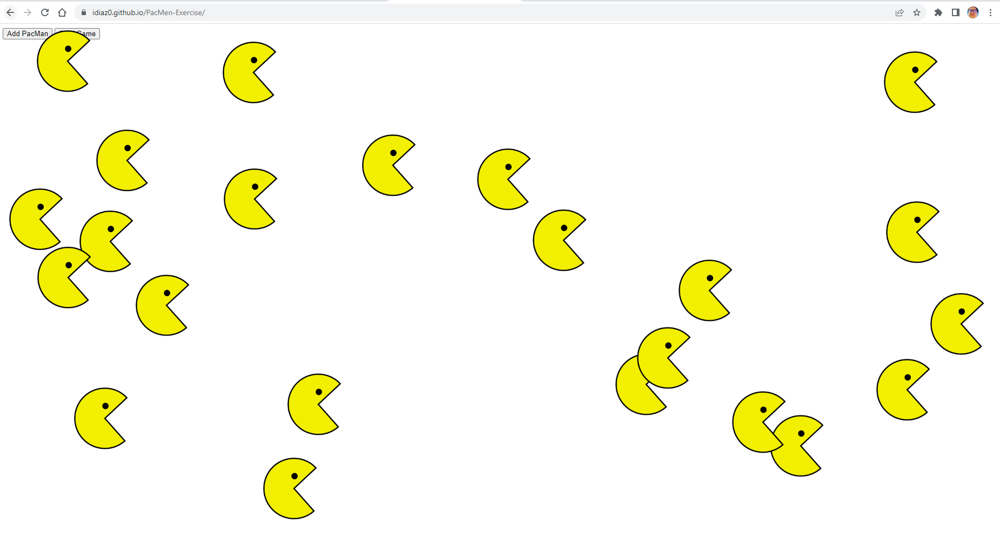

# idiaz0.github.io.PacMen-Exercise
<h1>This app was develop using javascript, html and css.</h1>
 
</img> 

The code can be used for apps oriented for tracking bus, shows possible routes and so on. The most importat thing here is the questions derivated to this. 
Is it possible to have the shortes route? If so, Wich one is.
Will the solution be constant? or Is this one be variant on time?
Because the routes can be diferente accordig to two or more different point, If We would try to monitize
the cost of every route, Can machine learning be used to learn according to variance?
Can those ruotes been automated using Electrical vehicles and self driving autonomus models?

